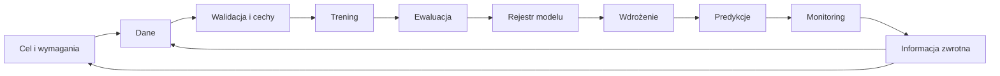

# Zajęcia 1. Od modelu w notebooku do systemu ML

## Informacje podstawowe

- **Przedmiot:** Techniki MLOps
- **Czas:** 90 minut
- **Charakter zajęć:** organizacyjno-wprowadzający z krótkim ćwiczeniem praktycznym
- **Tryb pracy:** indywidualny
- **Wymagania wstępne:** podstawy Pythona i uczenia maszynowego
- **Środowisko:** Jupyter Notebook uruchamiany w przeglądarce albo z odtwarzalnego repozytorium
- **Rezultat:** notebook zawierający kontrolę danych, model bazowy, wytrenowany model, metryki i wykresy


---

## 1. Organizacja przedmiotu

Zajęcia mają formę krótkiego wprowadzenia teoretycznego oraz indywidualnych ćwiczeń praktycznych. Efekty ćwiczeń i kolejne wersje projektu należy przechowywać w indywidualnym repozytorium Git.

### Projekt zaliczeniowy

Projekt końcowy wykonywany jest **indywidualnie**. Każdy student:

- samodzielnie wybiera publiczny zbiór danych, np. z Kaggle lub UCI Machine Learning Repository;
- przedstawia krótką charakterystykę danych, ich źródło, licencję i ograniczenia;
- dobiera model adekwatny do problemu oraz uzasadnia wybór;
- buduje powtarzalny proces przygotowania danych, treningu i ewaluacji;
- rozwija projekt o testy, wersjonowanie, CI, sposób predykcji i monitoring zgodnie z wybranym poziomem oceny;
- indywidualnie prezentuje i broni rozwiązanie.

Projekt nie może zależeć od plików przechowywanych tylko na komputerze w sali.

### Praca na komputerach bez trwałego stanu

Na kolejnych zajęciach można otrzymać inny komputer. Dlatego:

1. repozytorium jest podstawowym źródłem kodu i dokumentacji;
2. dane muszą być małe albo możliwe do ponownego pobrania;
3. zależności powinny być zapisane i przypięte do wersji;
4. modele oraz większe wyniki należy przechowywać jako artefakty CI, w rejestrze lub w wyznaczonym magazynie;
5. na koniec zajęć należy wysłać zmiany do repozytorium;
6. nie wolno zapisywać tokenów, haseł ani innych sekretów w projekcie;
7. przed odejściem od komputera należy wylogować się ze wszystkich usług.

## 2. Cele pierwszych zajęć

Po zakończeniu zajęć student:

1. odróżnia model od kompletnego systemu ML;
2. zna podstawowy cykl życia rozwiązania ML;
3. rozumie rolę wersjonowania, powtarzalności, testowania i monitoringu;
4. potrafi wczytać oraz zweryfikować podstawowe właściwości zbioru danych;
5. potrafi utworzyć funkcję walidującą dane;
6. trenuje model bazowy oraz prosty model klasyfikacyjny;
7. oblicza metryki i tworzy wykres macierzy pomyłek;
8. zapisuje model i wyniki jako osobne artefakty.

## 3. Model ML a system ML

**Model uczenia maszynowego** jest funkcją, która na podstawie wejścia generuje predykcję. Przykładem jest klasyfikator przypisujący obserwację do jednej z klas.

**System ML** obejmuje model oraz wszystkie elementy potrzebne do regularnego i bezpiecznego dostarczania użytecznej predykcji:

- pozyskanie i walidację danych;
- przygotowanie cech;
- kod treningu i ewaluacji;
- konfigurację oraz zależności;
- przechowywanie i wersjonowanie modelu;
- usługę online albo proces predykcji wsadowej;
- integrację z innymi aplikacjami;
- monitoring, alarmy i obsługę incydentów;
- informację zwrotną oraz ponowne trenowanie;
- dokumentację, kontrolę dostępu i odpowiedzialność.

Model może osiągać dobry wynik na historycznym zbiorze testowym, a mimo to nie nadawać się do użycia. Przykładowe przyczyny:

- dane produkcyjne mają inny format niż dane treningowe;
- model używa cechy niedostępnej podczas predykcji;
- aplikacja wymaga odpowiedzi szybszej, niż potrafi dostarczyć model;
- zachowanie użytkowników zmienia się z czasem;
- wynik modelu ma inny format niż oczekuje aplikacja;
- w logach zapisywane są dane osobowe;
- nie wiadomo, która wersja modelu działa w danym momencie;
- nie istnieje procedura wycofania wadliwej wersji.

> Jakość modelu jest konieczna, ale nie wystarcza do zbudowania wartościowego i niezawodnego systemu ML.

## 4. Czym jest MLOps?

MLOps to zbiór praktyk łączących uczenie maszynowe, inżynierię oprogramowania, pracę z danymi i utrzymanie systemów. Jego celem jest uporządkowanie drogi od eksperymentu do rozwiązania działającego w sposób powtarzalny, obserwowalny i bezpieczny.

MLOps nie jest pojedynczym narzędziem. Nie każdy projekt wymaga chmury, Kubernetes ani rozbudowanej platformy. Zakres automatyzacji należy dobrać do skali, kosztu i konsekwencji błędu.

### Podstawowe zasady

1. **Wersjonowanie** — trzeba znać wersję kodu, danych, konfiguracji i modelu.
2. **Powtarzalność** — projekt powinien działać również na czystym środowisku.
3. **Automatyzacja** — częste i podatne na pomyłki czynności powinien wykonywać potok.
4. **Testowanie** — kontroli podlegają kod, dane, cechy, model i kontrakt predykcji.
5. **Obserwowalność** — po wdrożeniu należy mierzyć stan usługi, danych, predykcji oraz wynik użytkowy.
6. **Kontrolowana zmiana** — nowa wersja modelu wymaga ewaluacji, zatwierdzenia i możliwości wycofania.
7. **Identyfikowalność** — każdą wdrożoną wersję należy powiązać z kodem, danymi i eksperymentem.
8. **Bezpieczeństwo** — sekrety, dane osobowe i artefakty wymagają właściwej ochrony.

## 5. Cykl życia systemu ML

Proces ML jest cykliczny. Wyniki monitoringu i nowe dane mogą prowadzić do zmiany danych, kodu, modelu albo celu rozwiązania.



| Etap | Przykładowy artefakt | Przykładowa automatyczna kontrola |
|---|---|---|
| Dane | wersja lub manifest danych | walidacja schematu i braków |
| Przygotowanie cech | kod transformacji | test jednostkowy transformacji |
| Trening | konfiguracja i wytrenowany model | zapis parametrów i ziarna losowości |
| Ewaluacja | metryki i wykresy | próg minimalnej jakości |
| Rejestracja | wersja modelu i metadane | sprawdzenie sygnatury modelu |
| Wdrożenie | obraz lub pakiet | test kontraktu i test uruchomienia |
| Monitoring | logi, raport lub dashboard | alert dla błędów i zmian danych |

### Rodzaje metryk

System ML należy obserwować na kilku poziomach:

- **model:** np. accuracy, precision, recall, F1 albo MAE;
- **dane:** np. liczba braków, nowe kategorie i zmiana rozkładu;
- **system:** np. czas odpowiedzi, udział błędów i przepustowość;
- **wynik użytkowy:** np. czas obsługi, koszt procesu i liczba ręcznych poprawek.

Poprawa jednej metryki modelu nie gwarantuje poprawy całego systemu. Przykładowo wyższa accuracy może ukrywać bardzo słabą jakość dla rzadkiej, lecz ważnej klasy.

## 6. Artefakty i odtwarzalność

Artefakt to zapis wejścia, ustawienia albo wyniku procesu ML. Przykładowe artefakty:

- wersja kodu;
- wersja lub manifest danych;
- plik zależności;
- konfiguracja eksperymentu;
- raport jakości danych;
- metryki i wykresy;
- wytrenowany model;
- sygnatura modelu;
- konfiguracja wdrożenia;
- karta modelu.

Dobra identyfikowalność pozwala ustalić, z jakiej wersji modelu, kodu, konfiguracji i danych pochodziła konkretna predykcja. Plik nazwany `model_final_v2.pkl` nie zawiera wystarczających informacji o swoim pochodzeniu.

## 7. Dług techniczny w systemach ML

Dług techniczny to przyszły koszt wynikający z dzisiejszych skrótów. W systemach ML jest szczególnie istotny, ponieważ działanie rozwiązania zależy zarówno od kodu, jak i od zmieniających się danych.

Przykładowe źródła długu:

- zmienne lub nieudokumentowane źródła danych;
- cechy obliczane inaczej podczas treningu i predykcji;
- ręczne przekazywanie modeli;
- parametry zapisane bezpośrednio w notebooku;
- brak testów jakości danych;
- brak informacji o środowisku i zależnościach;
- brak monitoringu jakości po wdrożeniu;
- zależność innych aplikacji od nieudokumentowanego formatu predykcji.

Notebook przygotowany podczas ćwiczenia jest eksperymentem, a nie gotowym systemem. Na kolejnych zajęciach jego elementy zostaną przeniesione do funkcji, modułów, testów i zautomatyzowanego potoku.

## 8. Ćwiczenie praktyczne: pierwszy eksperyment ML

### Cel

Utwórz indywidualny notebook `notebooks/01_pierwszy_eksperyment.ipynb`. Każde polecenie wykonaj w **osobnej komórce**. Bezpośrednio przed komórką kodu dodaj komórkę Markdown z numerem i krótkim opisem wykonywanego kroku.

Kod napisz samodzielnie. Możesz korzystać z Chatu, dokumentacji i podpowiedzi IDE. Nie proś jednak o wygenerowanie całego notebooka naraz. Rozwiązuj po jednym małym problemie, uruchamiaj wynik i sprawdzaj, czy rzeczywiście wykonuje polecenie.

Ćwiczenie nie jest częścią projektu zaliczeniowego. Służy przygotowaniu środowiska i pokazaniu artefaktów, które powstają nawet w małym eksperymencie.


### 8.5. Oczekiwana struktura artefaktów

```text
notebooks/
└── 01_pierwszy_eksperyment.ipynb
artifacts/
└── zajecia_01/
    ├── reports/
    │   ├── class_distribution.png
    │   ├── confusion_matrix.png
    │   └── metrics.json
    └── models/
        └── model.joblib
```

Ostatnia komórka notebooka powinna zawierać:

- wynik modelu bazowego;
- wynik regresji logistycznej;
- informację, który model jest lepszy według macro F1;
- jedno zdanie wyjaśniające, dlaczego sam notebook nie jest jeszcze systemem produkcyjnym.

Jeżeli pliki binarne są wykluczone z repozytorium, zapisz je jako artefakty CI lub zgodnie z instrukcją prowadzącego. Nie dodawaj dużych plików bez sprawdzenia zasad repozytorium.


## 10. Literatura

1. D. Sculley i in., **Hidden Technical Debt in Machine Learning Systems**, NeurIPS 2015:
   <https://papers.neurips.cc/paper/5656-hidden-technical-debt-in-machine-learning-systems>
2. Google Cloud, **MLOps: Continuous delivery and automation pipelines in machine learning**:
   <https://cloud.google.com/architecture/mlops-continuous-delivery-and-automation-pipelines-in-machine-learning>
3. Google Cloud, **Practitioners Guide to MLOps**:
   <https://cloud.google.com/resources/mlops-whitepaper>
4. scikit-learn, **Iris dataset**:
   <https://scikit-learn.org/stable/modules/generated/sklearn.datasets.load_iris.html>

---